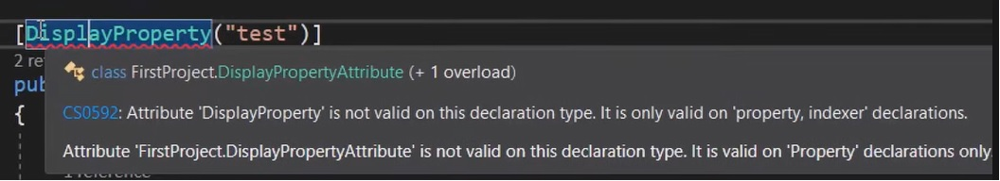

# Atrybuty

Atrybuty są to specjalne klasy, które służą do dodawania metadanych, które można przypisywać do elementów programu, takich jak klasy, metody, właściwości i pola. Atrybuty pozwalają na zdefiniowanie dodatkowych informacji o danym elemencie i umożliwiają dostęp do tych informacji w czasie wykonywania programu przy użyciu refleksji. Aby skorzystać z atrybutu, trzeba umieścić jego nazwę ujętą w nawiasy kwadratowe `[AttibuteName]` nad deklaracją jednostki, której dotyczy.

## Predefiniowane atrybuty 

W języku C# istnieją predefiniowane atrybuty, które umożliwiają dodawanie metadanych do kodu. Należą do nich:

1. Obsolete - oznacza, że dany element jest przestarzały i nie powinien być już używany.
2. Serializable - oznacza, że dany typ może być serializowany i przechowywany w pliku lub przesłany przez sieć.
3. DllImport - pozwala na importowanie funkcji z pliku DLL w celu wykorzystania ich w programie.
4. Conditional - umożliwia warunkowe wykonywanie fragmentów kodu.
5. AttributeUsage - określa, w jakim celu i w jakich sytuacjach można używać innych atrybutów. 

Atrybuty predefiniowane można również rozszerzać, tworząc własne atrybuty.

## Tworzenie własnych atrybutów 

Możliwe jest stworzenie własnych atrybutów niestandardowych.

### Przykład

```
using System;
using System.Collections.Generic;
using System.Linq;
using System.Text;
using System.Threading.Tasks;

namespace Attributes
{
    [AttributeUsage(AttributeTargets.Property)]
    public class DisplayPropertyAttribute : Attribute
    {
        public string DisplayName { get; set; }

        public DisplayPropertyAttribute(string displayName)
        {
            DisplayName = displayName;
        }
    }

    public class Person
    {
        [DisplayProperty("First Name")]
        public string FirstName { get; set; }

        [DisplayProperty("Last Name")]
        public string LastName { get; set; }
        public Address Address { get; set; }
    }
}
```

W powyższym przykładzie, stworzyliśmy nowy atrybut `DisplayPropertyAttribute`, który dziedziczy po klasie `Attribute`. Jego zadaniem jest przechowywanie dodatkowych metadanych o konkretnej wartości, w jakiej chcemy sformatować nazwę danej właściwości dowolnego obiektu. 

Dodatkowo, dzięki nałożeniu predefiniowanego atrybutu `AttributeUsage`, ograniczyliśmy możliwość zastosowania naszego atrybutu tylko do właściwości klasy.

```
        [AttributeUsage(AttributeTargets.Property)]
```

Gdybyśmy teraz chcieli wykorzystać go na przykład na klasie `Person`, to dostaniemy następujący błąd kompilacji.

 


Następnie nałożyliśmy ten atrybut na właściwości `FirstName` i `LastName` dla klasy `Person` w następujący sposób:

```
        [DisplayProperty("First Name")]
        public string FirstName { get; set; }

        [DisplayProperty("Last Name")]
        public string LastName { get; set; }
```

Warto zauważyć, że aby użyć naszego nowo utworzonego atrybutu, wystarczy posłużyć się nazwą `DisplayProperty` zamiast `DisplayPropertyAttribute`. Kompilator nie wymaga od nas abyśmy posługiwali się pełną nazwą tej klasy, możemy więc pominąć końcówkę `Attribute` przy zastosowaniu atrybutu.

Natomiast samo nałożenie atrybutu na klasę lub właściwości, w żaden sposób **nie zmienia wartości utworzonego obiektu**, a dodaje za to metadane, które można odczytać za pomocą refleksji.

## YouTube
https://www.youtube.com/watch?v=d-f5IRC2w-Y&t=1772s